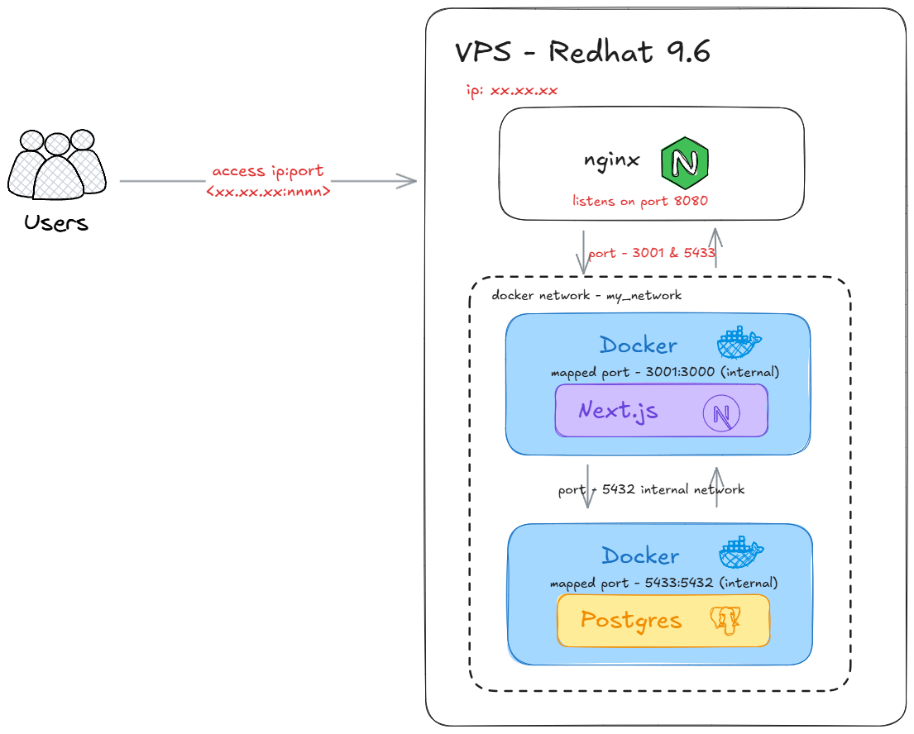

# Complete Deployment & Development Guide

## Overview

This guide covers the complete workflow for developing, deploying, and updating your Next.js application on a VPS.

## ⚠️ Required Configuration Changes

Before running the deployment script, you **MUST** customize these configuration variables:

### In `deploy.sh` (lines 4-10):

| Variable | Default Value | What to Change |
|----------|---------------|----------------|
| `TOI_DOMAIN_NAME` | `"5.223.58.235"` | **Replace with your server IP or domain name** |
| `TOI_EMAIL` | `"bernard.hex@gmail.com"` | **Replace with your email address** |
| `TOI_SECRET_KEY` | `"toi-secret"` | Change to a secure random string |
| `NEXT_PUBLIC_TOI_SAFE_KEY` | `"toi-key"` | Change to your desired key |
| `TOI_POSTGRES_PASSWORD` | Auto-generated | Leave as-is (automatically generates secure password) |

### Optional Configuration:

| Variable | Default Value | Description |
|----------|---------------|-------------|
| `TOI_POSTGRES_DB` | `"toi-db"` | Database name |
| `TOI_POSTGRES_USER` | `"toi-user"` | Database username |
| `TOI_REPO_URL` | `"https://github.com/pybern/selfhost.git"` | Your Git repository URL |
| `TOI_APP_DIR` | `~/toiapp` | Installation directory on server |
| `TOI_SWAP_SIZE` | `"1G"` | Swap space size |

### Example Configuration:

```bash
# Before (default values - DO NOT USE AS-IS)
TOI_DOMAIN_NAME="5.223.58.235"
TOI_EMAIL="bernard.hex@gmail.com"

# After (your custom values)
TOI_DOMAIN_NAME="myapp.example.com"  # or "123.45.67.89" for IP
TOI_EMAIL="you@yourdomain.com"
```

## 🚨 VPS-Level Configuration Considerations

### ⚠️ Before Running This Script

This deployment script makes system-level changes that **may conflict with existing applications** on your VPS. Review the following considerations carefully.

### Port Usage & Conflicts

The deployment uses these ports by default:

| Port | Service | Potential Conflict |
|------|---------|-------------------|
| **80** | Nginx reverse proxy | 🔴 **HIGH RISK** - Will conflict with existing web servers |
| **3000** | Next.js application | 🟡 Medium risk if another app uses this port |
| **5432** | PostgreSQL database | 🟡 Medium risk if PostgreSQL already installed |

#### Port 80 - Critical Consideration

**If you use an IP address** as `TOI_DOMAIN_NAME`:
- Nginx will capture **ALL HTTP traffic** on port 80
- Any other websites on the same VPS will become inaccessible
- **Recommendation**: Use a specific domain name instead

**If you use a domain name** as `TOI_DOMAIN_NAME`:
- Nginx will only capture traffic for that specific domain
- Other domains/sites on the same VPS will continue to work
- **This is the safest option for multi-app VPS**

### Check for Conflicts Before Deploying

Run these commands on your VPS to check for existing services:

```bash
# Check if ports are already in use
sudo netstat -tulpn | grep :80
sudo netstat -tulpn | grep :3000
sudo netstat -tulpn | grep :5432

# Check if Nginx is already installed
nginx -v

# Check if Docker is already installed
docker --version

# Check existing Nginx sites
ls -la /etc/nginx/sites-enabled/

# Check if PostgreSQL is running
sudo systemctl status postgresql
```

### Multi-App VPS Deployment Options

If you're running other applications on the same VPS, choose one of these approaches:

#### Option 1: Use Domain-Based Routing (Recommended)

```bash
# In deploy.sh, use a domain instead of IP
TOI_DOMAIN_NAME="myapp.example.com"  # Not "123.45.67.89"
```

This ensures Nginx only handles traffic for this specific domain, leaving other apps untouched.

#### Option 2: Change Ports

**Modify `docker-compose.yml`** to use different external ports:

```yaml
services:
  web:
    ports:
      - '8080:3000'  # Change from 3000:3000
  db:
    ports:
      - '5433:5432'  # Change from 5432:5432
```

**Modify `deploy.sh`** Nginx configuration (line 118):

```bash
server {
    listen 8080;  # Change from 80 to any free port
    server_name $TOI_DOMAIN_NAME;
    location / {
        proxy_pass http://localhost:3000;
        # ... rest of config
    }
}
```

#### Option 3: Use Subdirectory Routing

Serve the app from a subdirectory (e.g., `yourdomain.com/app`) instead of the root domain. Requires modifying the Nginx config:

```nginx
location /app/ {
    proxy_pass http://localhost:3000/;
    # ... rest of proxy settings
}
```

### System-Level Changes Made by Script

Be aware that the script makes these system-wide changes:

| Change | Impact | Risk Level |
|--------|--------|------------|
| System package updates (`apt upgrade`) | Updates all packages | 🟢 Low - but may affect dependency versions |
| Docker installation | Installs Docker CE | 🟢 Low - safe if not already installed |
| Nginx installation | Installs Nginx | 🟡 Medium - safe, but restart affects all sites |
| Swap file creation (`/swapfile`) | Creates 1GB swap | 🟢 Low - conflicts only if `/swapfile` exists |
| Docker Compose installation | Installs Docker Compose v2.24.0 | 🟢 Low - standalone binary |
| Nginx restart | Reloads all Nginx configs | 🟡 Medium - may expose issues in other configs |

### Isolated Resources (No Conflicts)

These resources are isolated and won't conflict with other apps:

- ✅ Application directory: `~/toiapp/`
- ✅ Environment file: `~/toiapp/.env`
- ✅ Nginx site config: `/etc/nginx/sites-available/toiapp`
- ✅ Docker volumes: `postgres_data` (unique to this app)
- ✅ Docker network: `my_network` (can be renamed if needed)
- ✅ Docker containers: Named `toiapp-web-1`, `toiapp-db-1`, `toiapp-cron-1`

### Recommendations for Shared VPS

1. **Use a specific domain name**, not an IP address
2. **Check for port conflicts** before running the script
3. **Test Nginx config** before restarting: `sudo nginx -t`
4. **Back up existing Nginx configs** before deployment
5. **Use unique Docker network names** if running multiple Docker apps
6. **Monitor resource usage** after deployment (RAM, CPU, disk)
7. **Consider using Docker resource limits** for production

### Fresh VPS vs. Shared VPS

| Scenario | Recommendation |
|----------|----------------|
| **Fresh VPS** (no existing apps) | Run script as-is after updating config variables |
| **Shared VPS** (existing apps) | Review all sections above, use domain-based routing |
| **Existing Nginx** | Test config with `sudo nginx -t` before deploying |
| **Existing PostgreSQL** | Change PostgreSQL port in `docker-compose.yml` |
| **Port 80 in use** | Use different port or domain-based routing |

### Verifying Deployment Won't Break Existing Apps

Before running `deploy.sh`:

```bash
# 1. Backup existing Nginx config
sudo cp -r /etc/nginx /etc/nginx.backup

# 2. Check what's using port 80
sudo lsof -i :80

# 3. List all Nginx sites
ls -la /etc/nginx/sites-enabled/

# 4. Check Docker networks (if Docker is installed)
docker network ls

# 5. Review running Docker containers
docker ps -a

# 6. Check available disk space
df -h

# 7. Check available RAM
free -h
```

If any of these checks show conflicts, adjust the deployment configuration accordingly before proceeding.

## Architecture



<details>
<summary>Text Diagram (click to expand)</summary>

```
┌─────────────────┐    ┌──────────────────┐    ┌─────────────────┐
│   Development   │───▶│   GitHub Repo    │───▶│   VPS Server    │
│   Environment   │    │  pybern/selfhost │    │  Ubuntu Linux   │
└─────────────────┘    └──────────────────┘    └─────────────────┘
                                                       │
                                              ┌─────────▼─────────┐
                                              │     Nginx         │
                                              │ Reverse Proxy     │
                                              └─────────┬─────────┘
                                                       │
                                              ┌─────────▼─────────┐
                                              │   Docker Compose  │
                                              │                   │
                                              │ ┌─────────────┐   │
                                              │ │  Next.js    │   │
                                              │ │ Container   │   │
                                              │ │   :3000     │   │
                                              │ └─────────────┘   │
                                              │                   │
                                              │ ┌─────────────┐   │
                                              │ │ PostgreSQL  │   │
                                              │ │ Container   │   │
                                              │ │   :5432     │   │
                                              │ └─────────────┘   │
                                              │                   │
                                              │ ┌─────────────┐   │
                                              │ │ Cron Job    │   │
                                              │ │ Container   │   │
                                              │ └─────────────┘   │
                                              └───────────────────┘
```

</details>

## Initial Setup Process

### 1. Server Preparation

```bash
# SSH into your server
ssh root@your_server_ip

# Download deployment script
curl -o ~/deploy.sh https://raw.githubusercontent.com/pybern/selfhost/main/deploy.sh

# Make it executable
chmod +x ~/deploy.sh

# Edit the script to customize your environment variables
nano ~/deploy.sh
```

### 2. Customize Configuration Variables

**IMPORTANT**: Edit `deploy.sh` and change at minimum:
- `TOI_DOMAIN_NAME` - Your domain or server IP
- `TOI_EMAIL` - Your email address

```bash
nano ~/deploy.sh
```

### 3. Run Initial Deployment

```bash
./deploy.sh
```

This will:
- Install Docker, Docker Compose, Nginx
- Clone your repository to `~/toiapp`
- Create `.env` file with database credentials
- Build and start all containers
- Configure Nginx reverse proxy

## Development Workflow

### 1. Local Development

```bash
# Clone your repository locally
git clone https://github.com/pybern/selfhost.git
cd selfhost

# Install dependencies
npm install

# Run locally with Docker
docker-compose up -d

# Or run in development mode
npm run dev
```

### 2. Testing Changes

```bash
# Test with Docker (production-like environment)
docker-compose up --build -d

# Check logs
docker-compose logs web

# Access at http://localhost:3000
```

### 3. Deploying Updates

```bash
# Commit your changes
git add .
git commit -m "Add new feature"
git push origin main

# SSH into your server
ssh root@your_server_ip

# Navigate to app directory
cd ~/toiapp

# Run update script
./update.sh
```

## Environment Variables Reference

### Server Environment Variables (set in deploy.sh)

| Variable | Purpose | Example |
|----------|---------|---------|
| `TOI_POSTGRES_USER` | Database username | `toi-user` |
| `TOI_POSTGRES_PASSWORD` | Database password | `auto-generated` |
| `TOI_POSTGRES_DB` | Database name | `toi-db` |
| `TOI_SECRET_KEY` | App secret key | `toi-secret` |
| `NEXT_PUBLIC_TOI_SAFE_KEY` | Client-side env var | `toi-key` |
| `TOI_DOMAIN_NAME` | Your domain/IP | `example.com` |
| `TOI_EMAIL` | Your email | `you@example.com` |

### Generated Environment Variables (in .env file)

| Variable | Purpose |
|----------|---------|
| `TOI_DATABASE_URL` | Internal Docker connection |
| `TOI_DATABASE_URL_EXTERNAL` | External tools connection |

## File Structure on Server

```
~/toiapp/
├── .env                    # Environment variables
├── deploy.sh               # Initial deployment script
├── update.sh              # Update deployment script
├── docker-compose.yml     # Container orchestration
├── Dockerfile             # Next.js container build
├── package.json           # Dependencies
├── next.config.ts         # Next.js configuration
├── app/                   # Next.js application
│   ├── db/               # Database related files
│   │   ├── drizzle.ts    # Database connection
│   │   ├── schema.ts     # Database schema
│   │   └── migrations/   # Database migrations
│   └── ...
└── public/               # Static files
```

## Database Management

### Connecting to Database

```bash
# From server, enter database container
docker exec -it toiapp-db-1 psql -U toi-user -d toi-db

# Run SQL commands
SELECT * FROM todos;

# Exit
\q
```

### Using Drizzle Studio

```bash
# From ~/toiapp directory
npm run db:studio
```

Access at `http://your-server-ip:4983`

### Schema Changes

```bash
# Generate migration after schema changes
npm run db:generate

# Apply migrations
npm run db:push
```

## Monitoring and Troubleshooting

### Container Status

```bash
cd ~/toiapp
docker-compose ps
```

### View Logs

```bash
# All services
docker-compose logs

# Specific service
docker-compose logs web
docker-compose logs db
docker-compose logs cron
```

### System Health

```bash
# Check system resources
free -h
df -h
top

# Check nginx status
sudo systemctl status nginx

# Test nginx configuration
sudo nginx -t
```

### Common Issues and Solutions

#### 1. Environment Variable Errors

**Error**: `The "POSTGRES_DB" variable is not set`
**Solution**: Ensure `docker-compose.yml` uses `TOI_` prefixed variables

#### 2. Build Failures

**Error**: `npm run build failed`
**Solution**: 
- Check application code for errors
- Verify all dependencies are installed
- Check Next.js configuration

#### 3. Database Connection Issues

**Error**: Database connection refused
**Solution**:
- Ensure database container is running
- Check `.env` file has correct database URL
- Verify container networking

#### 4. Nginx Errors

**Error**: `nginx.service failed`
**Solution**:
- Check nginx configuration: `sudo nginx -t`
- View logs: `journalctl -xeu nginx.service`
- Restart nginx: `sudo systemctl restart nginx`

## Performance Optimization

### 1. Docker Image Size

- Uses multi-stage builds
- Standalone Next.js output reduces size by 80%

### 2. Nginx Configuration

- Rate limiting (10 requests/second)
- Proxy buffering disabled for streaming
- Gzip compression handled by Nginx

### 3. Database

- Persistent volumes for data
- Automatic cleanup cron job (every 10 minutes for demo)

## Security Considerations

### 1. Environment Variables

- All sensitive data in `.env` file
- Database password auto-generated
- No secrets in repository

### 2. Network Security

- Containers isolated in Docker network
- Nginx rate limiting
- SSL/TLS ready (commented out in current setup)

### 3. Updates

- Regular system updates via `apt update && apt upgrade`
- Container isolation

## SSL/HTTPS Setup (Optional)

To enable SSL, uncomment the certbot sections in `deploy.sh`:

```bash
# Uncomment these lines in deploy.sh (lines 102-112)
sudo apt install certbot -y
sudo certbot certonly --standalone -d $TOI_DOMAIN_NAME --non-interactive --agree-tos -m $TOI_EMAIL
```

Then update the Nginx configuration to include SSL.

## Backup Strategy

### 1. Database Backup

```bash
# Create backup
docker exec toiapp-db-1 pg_dump -U toi-user toi-db > backup.sql

# Restore backup
docker exec -i toiapp-db-1 psql -U toi-user toi-db < backup.sql
```

### 2. Environment Backup

```bash
# Backup .env file
cp ~/toiapp/.env ~/toiapp-env-backup
```

### 3. Code Backup

Your code is already backed up in your GitHub repository.

## Scaling Considerations

### Horizontal Scaling

- Load balancer in front of multiple app instances
- Separate database server
- Redis for session storage/caching

### Vertical Scaling

- Increase server resources (CPU, RAM)
- Optimize Docker resource limits
- Database performance tuning

## Clean Up

If you need to completely remove the installation:

```bash
# Download and run cleanup script
curl -o ~/cleanup.sh https://raw.githubusercontent.com/pybern/selfhost/main/cleanup.sh
chmod +x ~/cleanup.sh
./cleanup.sh
```

## Helpful Commands

### Docker Management
- `docker-compose ps` – check status of Docker containers
- `docker-compose logs web` – view Next.js output logs
- `docker-compose logs db` – view PostgreSQL logs
- `docker-compose logs cron` – view cron logs
- `docker-compose down` - shut down the Docker containers
- `docker-compose up -d` - start containers in the background
- `docker-compose restart web` - restart just the web container

### Container Access
- `docker exec -it toiapp-web-1 sh` - enter Next.js Docker container
- `docker exec -it toiapp-db-1 psql -U toi-user -d toi-db` - enter Postgres db

### System Management
- `sudo systemctl restart nginx` - restart nginx
- `sudo systemctl status nginx` - check nginx status
- `journalctl -xeu nginx.service` - view nginx error logs

### Database Management
- `npm run db:studio` - open Drizzle Studio (from ~/toiapp)
- `npm run db:generate` - generate new migrations
- `npm run db:push` - push schema changes

## Supported Features

This demo showcases many different Next.js features:

- Image Optimization
- Streaming
- Talking to a Postgres database
- Caching
- Incremental Static Regeneration
- Reading environment variables
- Using Middleware
- Running code on server startup
- A cron that hits a Route Handler

## Support and Resources

- [Next.js Documentation](https://nextjs.org/docs)
- [Docker Compose Documentation](https://docs.docker.com/compose/)
- [Nginx Documentation](https://nginx.org/en/docs/)
- [Drizzle ORM Documentation](https://orm.drizzle.team/)
- [Kubernetes Example](https://github.com/ezeparziale/nextjs-k8s)
- [Redis Cache Adapter for Next.js](https://github.com/vercel/next.js/tree/canary/examples/cache-handler-redis)
- [ipx – Image optimization library](https://github.com/unjs/ipx)
- [OrbStack - Fast Docker desktop client](https://orbstack.dev/)

## Changelog

- **v1.0**: Initial setup with TOI_ environment variables
- **v1.1**: Added comprehensive deployment guide
- **v1.2**: Updated for pybern/selfhost repository
- **v1.3**: Consolidated documentation with configuration warnings
